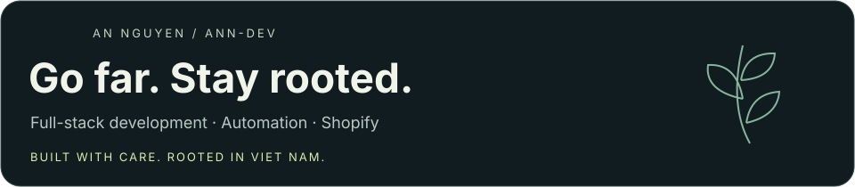
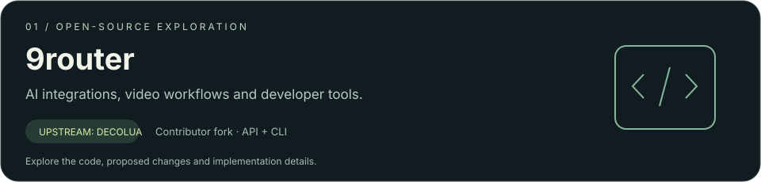
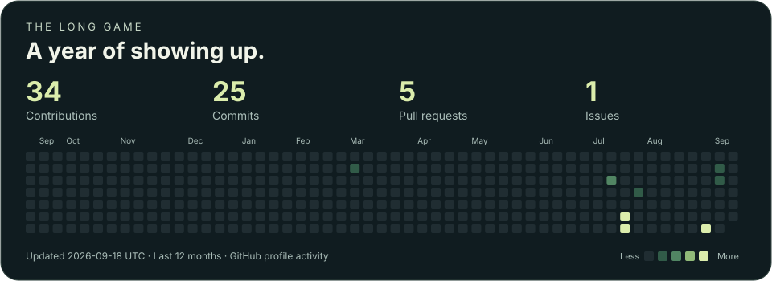
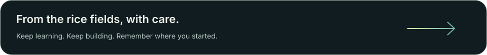

  
  

  **[Website](https://annguyen.com)** · **[Projects](#selected-work)** · **[Activity](#activity)** · **[Connect](#connect)**

  _Từ hạt gạo quê nhà đến những dòng code đi xa._

## Hello, I'm An

I build **clean web systems**, **automation tools**, and **Shopify solutions** that actually ship. I care about software that is useful, understandable, and dependable in everyday work.

🌾 **Raised by rice fields. Shaped by learning. Building with care.**

Mình lớn lên bằng cây lúa — bằng những mùa chỉ trả công cho người chịu ra đồng mỗi ngày, và bằng cha mẹ ra đồng mà chẳng ai phải nhắc. Con chữ đưa mình qua khỏi bờ đê. Dòng code đưa mình đi xa hơn nữa.

> Đi xa để mở mang tầm mắt, giữ quê nhà để lòng mình có chốn quay về.

<strong>A little more about my roots</strong>

School carried me past the dyke roads. Code carried me further still. Now I build the quiet kind of software people lean on without noticing it is there.

I never left in order to get away. Whatever I learn out here comes home with me, because the point was always the same: come back able to build something for the place that grew me.

Nhưng đi chưa bao giờ là để rời đi. Học được gì ngoài kia, mình mang về bấy nhiêu — bởi đích đến vẫn là ngày quay lại, đủ sức góp tay dựng lấy quê mình.

## What I build

| Web systems | Automation | Commerce |
| :--- | :--- | :--- |
| Clear interfaces and practical backend services. | Tools that connect APIs and take repetitive work off people's hands. | Shopify solutions built around everyday store workflows. |
| **Frontend ↔ API ↔ Data** | **Integrations · Scripts · CLI** | **Shopify · Custom workflows** |

## Selected work

**[My fork](https://github.com/anndev-69/9router)** · **[Upstream project](https://github.com/decolua/9router)** · **[All my pull requests](https://github.com/pulls?q=is%3Apr+author%3Aanndev-69)**

### Contributions & experiments

A closer look at the changes I've proposed to **9router**:

| Work | What I explored | Links |
| :--- | :--- | :--- |
| **Grok Imagine video** | Video generation endpoints, async job handling and a CLI workflow. | [PR #2593](https://github.com/decolua/9router/pull/2593) |
| **Codex image aliases** | Model discovery, image routing and regression coverage for Sol, Terra and Luna aliases. | [PR #3806](https://github.com/decolua/9router/pull/3806) |

These are proposed contributions. Both PRs were closed without merge at the time of this profile refresh; follow the links for current status.

## Toolbox

The tools in my stack, grouped by the work they help me do.

| Area | Technologies |
| :--- | :--- |
| **Languages** | TypeScript · JavaScript · Python · PHP · Go · Bash |
| **Frontend** | React · Next.js · Vue · Tailwind CSS · Sass · Vite · HTML · CSS |
| **Backend** | Node.js · Express · NestJS · Laravel · Django |
| **Data** | PostgreSQL · MySQL · MongoDB · Redis |
| **Delivery & design** | Git · Docker · Kubernetes · AWS · Cloudflare · Vercel · Linux · Figma |
| **Commerce & AI tools** | Shopify · Claude Code · OpenAI · xAI Grok · Gemini |

### How I approach the work

- **Understand the job.** Start with the problem and the people doing it.
- **Keep the system clear.** Choose tools that fit; make the next change easier.
- **Check the real path.** Test the behavior people rely on, including what can go wrong.
- **Keep learning.** Bring each lesson into the next thing I build.

## Activity

_Mỗi ô xanh là một ngày vun xới. Còn học, còn làm thì vẫn còn lớn lên._

Updated daily from GitHub · Counts follow GitHub profile visibility settings · [Live overview](https://github.com/anndev-69?tab=overview)

<strong>A little movement in the fields 🐍</strong>

 
<picture>
  <source media="(prefers-color-scheme: dark)" srcset="https://raw.githubusercontent.com/anndev-69/anndev-69/output/github-snake-dark.svg" />
  <source media="(prefers-color-scheme: light)" srcset="https://raw.githubusercontent.com/anndev-69/anndev-69/output/github-snake.svg" />
  
</picture>

## Connect

Bạn thích làm sản phẩm tử tế, hay chỉ muốn nói chuyện công nghệ bên một tách trà — mình luôn vui được kết nối.

**[Visit my website ↗](https://annguyen.com)** &nbsp; / &nbsp; **[Find me on X ↗](https://x.com/annguyen)** &nbsp; / &nbsp; **[Explore my repositories ↗](https://github.com/anndev-69?tab=repositories)**

 

